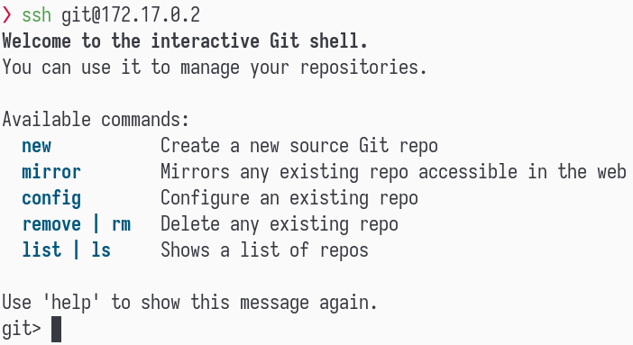

# :arrows_clockwise: Gitty

A single-user focused, container-based `git` server with HTTP/cgit web interface, SSH access and a
shell interactive interface with sensible defaults.

## What?

Using `Github` or `Gitlab` as your main git provider is mostly fine, but as a golden rule of thumb,
you should never put all your eggs in a single basket. A more tech-specific rule says a good backup
strategy is to store your data in at least 3 different places - and for any git-data you own, that's
a valid reason to use *Gitty*.

It can work as a simple mirror-backup of any git repositories you wish, and Gitty will automatically
keep all of them in sync with their sources.

Moreover, it can also work as a source repository server if you wish, and it's particularly useful
if you want to keep some repository private (such as the remote of your [`password-store`](pass)
data, for instance).

[pass]: https://www.passwordstore.org/

## Features

* **Git**
  * **Create mirror repos** - You can mirror any public-accessible repository and it will be
    synchronized automatically.
  * **Create source repos** - You can also create standalone repositories to serve as the remote for
    your projects.
  * **Web interface** - By using `cgit` you can visualize all your repos as well as perform HTTP
    pulls.
  * **Hidden repositories** - The web interface provides a convenience but sometimes you don't want
    to expose a repository through HTTP over your network. By naming a repository with a leading
    dot, it automatically becomes a hidden repo and is only accessible through SSH.
  * **Lightweight** - Gitty consumes less than 15MB of memory and its OCI image is less than 100MB.
* **Security**
  * **No management web interface** - The only web you will see is `cgit`, which is a visualization
    interface, nothing more. All management is done through SSH.
  * **SSH authentication by private keys only** - No unauthenticated or password-based auth for the
    SSH interface.
  * **No SSH _hidden_ features** - The [ssh config](rootfs/etc/ssh/sshd_config) disables most
    features useless for git such as forwarding, tunnelling, environment variables and etc.
* **Convenience**
  * **Shell management interface** - To manage your repos, you will need to connect to the `SSH` and
    you'll be automatically prompted by a interactive shell that will help you managing your git
    repositories.
  * **Automatic download of SSH public key** - You can configure gitty to pull your SSH public key
    from a specific location - such as _https://github.com/yourusername.keys_ - by simply setting an
    environment variable.

## Installation

Gitty is distributed as a single OCI image that you can deploy on any container orchestrator out
there. For starters, you can play with it locally using `Docker` with:

```sh
# Run the container
docker run --name gps \
  --env=SERVER_URL=my-cool-git-server.com \
  --env=AUTO_PULL_SSH_KEYS=https://github.com/my-user.keys 
  kriansa/gitty

# Get the IP address
docker inspect -f '{{range.NetworkSettings.Networks}}{{.IPAddress}}{{end}}' gps
```

That is enough and you can either open the web interface at `http://<ip>` or connect to the SSH
shell management interface by using `ssh git@<ip>`

## Configuration

Most configuration is done by the container environment variables. These variables should be set at
the container's creation.

* **SERVER_URL** - This is the domain (or IP address) that points to this git private instance.
* **AUTO_PULL_SSH_KEYS** - Configure a HTTP/S endpoint where your SSH public keys are hosted so
  gitty can automatically download them from time to time. _(optional)_
* **CGIT_TITLE** - Adjust the title of your web interface.
* **CGIT_DESC** - Adjust the text that appears right below the title of the web interface.

### Volumes

#### `/config` - Configuration files

There are other sets of configuration that are stored at the container's `/config` folder. This path
should be a **VOLUME** and its data backuped. It contains:

- `cgitrc` - Configuration for the `cgit` web interface
- `about.md` - The content of the about page displayed on the web interface.
- `ssh_authorized_keys` - This is the file that holds all SSH public keys authorized to connect to
  this server. It gets overwritten if `AUTO_PULL_SSH_KEYS` is set.
- `ssh_host_keys` - The server host keys, used to identify this server for clients connecting to it.
  If those keys are not present, they are recreated on the startup of the container, which will make
  clients connecting to this server not work anymore (unless you update the `~/.ssh/known_hosts` at
  the client)

#### `/srv/git` - Git repositories

All content in this folder are git repositories and they are probably the most precious asset you
want to preserve, so it goes without saying that this volume should be bound to the host and
backuped elsewhere.

## Management interface

To manage your repositories, you must connect to the SSH using the interactive shell:

```sh
ssh git@<myserverip>
```

> Remember to always connect using the `git` user as this is the only authorized user on SSH.

Right after a successful connection, you will be prompted with the following screen:



Then you can proceed with the command you want. After you're done, use `exit` or press `Ctrl-D` to
disconnect.

## Contributing

Pull requests are welcome. For major changes, please open an issue first to discuss what you would
like to change.

Please make sure to update tests as appropriate. For more information, please refer to
[Contributing](CONTRIBUTING.md).

## License

This project is licensed under the Apache v2 License - see the [LICENSE](LICENSE) file for details.
